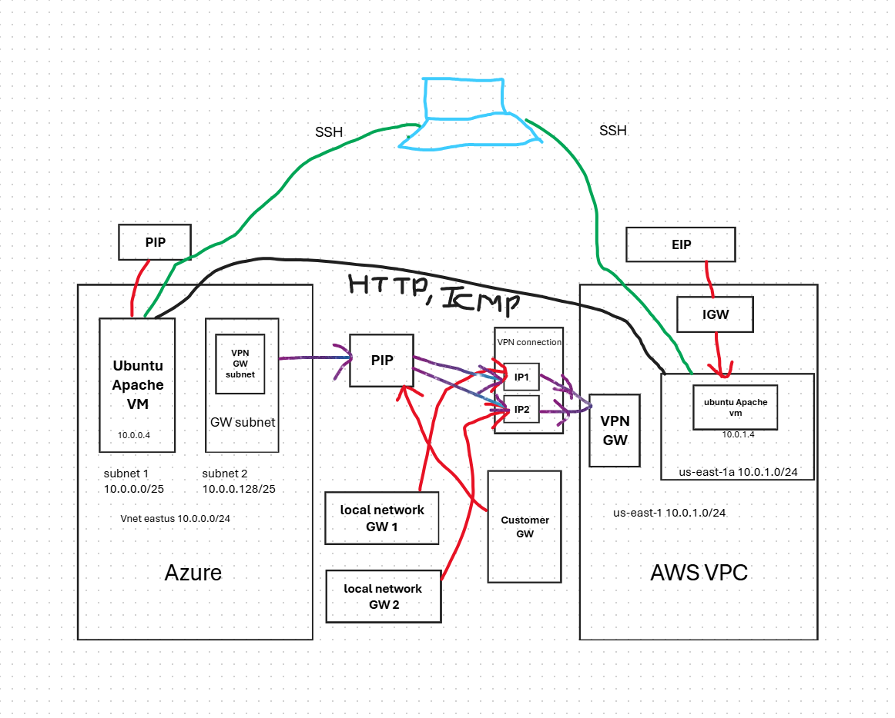

# site-to-site-vpn



## Configure AWS cli and Azure cli

```powershell
$env:AWS_ACCESS_KEY_ID="YOUR_AWS_ACCESS_KEY_ID"
$env:AWS_SECRET_ACCESS_KEY="YOUR_AWS_SECRET_ACCESS_KEY"

$env:ARM_CLIENT_ID="YOUR_ARM_CLIENT_ID"
$env:ARM_CLIENT_SECRET="YOUR_ARM_CLIENT_SECRET"
$env:ARM_TENANT_ID="YOUR_ARM_TENANT_ID"
$env:ARM_SUBSCRIPTION_ID="YOUR_ARM_SUBSCRIPTION_ID"
```

## Terraform commands

```bash
terraform init
terraform validate
terraform plan
terraform apply
```
## To destroy infra

```bash
terraform destroy
```

